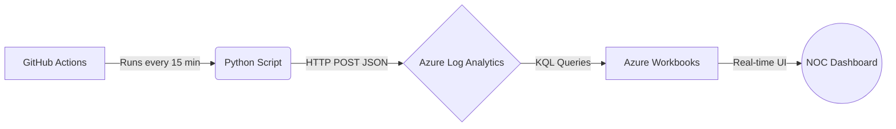
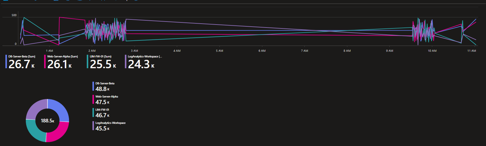
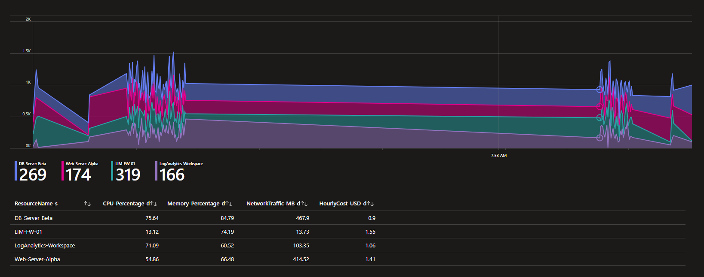

# ☁️ Azure NOC Operations Monitor

A fully automated Network Operations Center (NOC) simulation that generates, sends, and visualizes cloud infrastructure data using Python, GitHub Actions, and Microsoft Azure.

## Architecture Diagram

## Features
* **Automated Data Pipeline:** A CI/CD pipeline in GitHub Actions runs the Python generator automatically.
* **Hybrid Execution:** The Python script automatically detects if it's running locally (continuous loop) or in the cloud (single execution) to optimize resources.
* **Secure Credentials:** All Azure API keys and Workspace IDs are stored securely using GitHub Actions Secrets and environment variables.
* **Live Dashboards:** Data is visualized in Azure Workbooks using custom Kusto Query Language (KQL) to monitor CPU, Memory, Network Traffic, and Hourly Costs.

## Images

## Tools used
* **Language:** Python 3 (Requests, JSON, HMAC, Hashlib)
* **Automation:** GitHub Actions (CI/CD)
* **Cloud Platform:** Microsoft Azure (Log Analytics Workspace, Azure Monitor, Workbooks)

## Run it locally
If you want to run the simulator on your local machine:

1. Clone the repository.
2. Set your environment variables in your terminal:
   - `AZURE_WORKSPACE_ID`
   - `AZURE_WORKSPACE_KEY`
3. Run `python azure_billing.py`
4. The script will send data every 30 seconds until stopped manually.